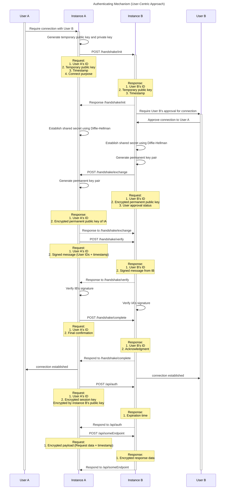
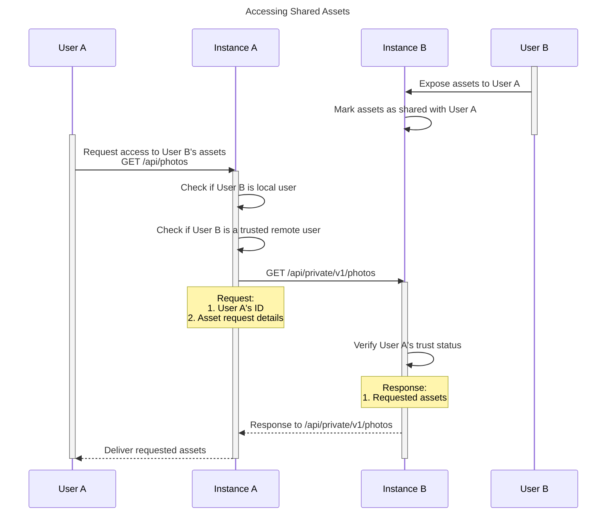

# Network & Sharing Documentation

This document outlines the authentication mechanism for user-to-user connections across different instances in a federated network. The process ensures secure communication and data exchange between users on separate instances.

## Basic Flow

1. **Trust Establishment**: User A on Instance A establish a trusted connection with User B on Instance B.
2. **Assets Sharing**: Based on the established trust, User A can make authenticated API requests to Instance B, access User B exposed assets.

## Detailed Flow

### Trust Establishment

#### Overview

The **Trust Establishment** part assume current connection between Instance A and Instance B is not in a secure state, the core algorism used is **Diffie-Hellman Key Exchange (DHKE)**, which allows two parties to generate a shared secret over the insecure channel. Finally, parties will exchange their permanent key pair for future authentication, each party will keep their own private key secret and share the public key with the other party.

#### Sequence Diagram

### Assets Sharing

#### Overview

Once the trust is established between User A and User B, User A can make authenticated API requests to Instance B to access User B's exposed assets.

When Instance A receives a request from User A to access User B's assets, it will first check if User B is a user in current instance, if not, it will check if User B is a trusted remote user. If so, the request would be federated to Instance B to fetch the assets.

We provide a private API endpoint on each assets like `/api/private/v1/photos` which only accept requests from trusted users.

#### Sequence Diagram

## Security Considerations

The application would determine if HTTPS is enabled between instances.

- If HTTPS is supported, instances will communicate directly using HTTPS.
- If not, instances will generate a symmetric key for encrypting the communication.

## Further implementation tasks

- Add a is local field in User table, enhance shared-user service to add the user into user table after trust establishment.
- Enhance all assets API to involve shared-user checking logic.
- Implement private API endpoints for assets.
