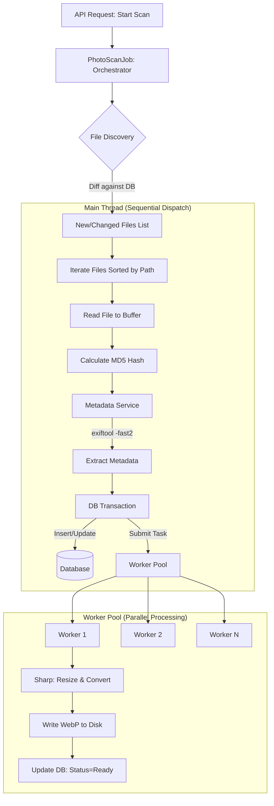

# Photo Scanning Architecture

## Executive Summary

The photo scanning system is a hybrid **sequential-dispatch, parallel-processing** pipeline designed to ingest large collections of RAW and standard photo files. It prioritizes **metadata accuracy** (using ExifTool) and **system responsiveness** (offloading image processing to worker threads).

**Key Technologies**: `exiftool-vendored`, `sharp`, Worker Threads, Prisma.

---

## Architecture Overview

### High-Level Data Flow

The architecture decouples **Metadata Extraction (ME)** from **Preview Generation (PG)** to ensure immediate data availability in the database while resource-intensive image processing happens in the background.

---

## Workflow Detail

### 1. Initialization & Discovery
*   **Trigger**: `PhotoScanJob.startPhotoScanJob()`
*   **Discovery**: Recursively walks the user's `basePath`.
*   **Diffing**: Compares found files against the database to identify:
    *   **Increased**: New files.
    *   **Matched**: Existing files (checked for changes via hash).
    *   **Not Matched**: Deleted files (removed from DB).

### 2. Sequential Processing (Main Thread)
For each file (processed sequentially to optimize HDD head movement):
1.  **Full Read**: The file is read entirely into a Node.js Buffer.
    *   *Purpose*: Required for MD5 hashing and passing to the image worker.
2.  **Hashing**: MD5 hash calculated from the buffer to detect duplicates or moves.
3.  **Metadata Extraction (exiftool)**:
    *   Service: `MetadataExtractionService`
    *   Tool: `exiftool-vendored` (Singleton Daemon)
    *   Optimization: Uses `-fast2` flag to read only file headers (avoiding full file scan).
    *   *Trade-off*: Results in a second, partial read of the file, but ensures 100% accurate dimensions for RAW files (CR2, NEF, ARW), correcting previous issues with thumbnail-only extraction.
4.  **Database Sync**:
    *   `Photo` and `PhotoFile` records are created/updated immediately.
    *   `PhotoLocation` is created if GPS data is present.
    *   `PhotoFile.previewStatus` is set to `Pending`.

### 3. Parallel Preview Generation (Worker Threads)
*   **Submission**: The file Buffer is passed to the `LazyPhotoProcessorPool`.
*   **Processing**:
    *   Worker receives the Buffer (zero-copy transfer where possible).
    *   **Sharp** processes the image:
        *   Auto-rotation (based on EXIF).
        *   Resizing (1200px bounding box).
        *   Format conversion (WebP, Quality 85).
    *   Result written to the `cachePath`.
*   **Completion**:
    *   Worker updates `PhotoFile.previewStatus` to `Ready` (or `Failed`).
    *   Worker releases memory and waits for the next task.

---

## Key Design Decisions

### 1. ExifTool for Metadata
**Decision**: Replace `exifr`/pure-JS parsers with `exiftool-vendored`.
**Rationale**:
*   **Correctness**: Pure JS parsers often read the wrong IFD (Thumbnail) for RAW files, leading to incorrect dimensions (e.g., reporting 160x120 for a 24MP image). ExifTool correctly identifies the SubIFD/Sensor dimensions.
*   **Performance**: The vendor library manages a daemon process, avoiding the overhead of spawning a new shell for every file. The `-fast2` flag keeps extraction times low (~15-20ms).

### 2. Worker Threads for Imaging
**Decision**: Use Node.js Worker Threads with `sharp`.
**Rationale**:
*   **Non-blocking**: Image resizing is CPU-intensive. Running it on the main thread would block the API and the scanning loop.
*   **Parallelism**: Allows utilizing all available CPU cores.
*   **Safety**: `sharp` (via libvips) is memory efficient and faster than ImageMagick.

### 3. Database Schema Enhancements
**Decision**: Normalized schema with Status tracking.
**Rationale**:
*   **`PhotoFile`**: Separates the physical file data from the logical `Photo`. Adds `previewStatus` enum (`Pending`, `Processing`, `Ready`, `Failed`) to track the async pipeline state.
*   **`PhotoLocation`**: Extracts GPS coordinates into a dedicated table/model, enabling future spatial queries (PostGIS) without cluttering the main `Photo` table.

### 4. Hybrid I/O Strategy
**Decision**: Read full file in Main Thread + Header read in ExifTool.
**Rationale**:
*   We need the full buffer for the Hash (duplicate detection) and the Worker (preview generation).
*   We need ExifTool for accurate metadata.
*   *Trade-off*: This results in reading the file data twice (once fully, once partially). This is accepted in favor of data integrity and robust duplicate detection.

---

## Performance Characteristics

*   **I/O Bound (Initially)**: The sequential read in the main thread paces the pipeline.
*   **CPU Bound (Steady State)**: As buffers are handed to workers, the system saturates CPU cores with `sharp` operations.
*   **Memory**: Controlled by the `LazyPhotoProcessorPool`. Workers are spawned based on CPU count, and strict memory limits can be enforced if necessary.
*   **Latency**: Metadata is available to the API almost immediately (ms). Previews become available progressively as workers finish (seconds).

## Directory Structure & Components

*   **`src/jobs/photo-scan.job.ts`**: Main orchestrator.
*   **`src/services/file-processing.service.ts`**: Facade for single-file operations (glue code).
*   **`src/services/metadata-extraction.service.ts`**: ExifTool wrapper.
*   **`src/services/scan-status.service.ts`**: Tracks overall job progress.
*   **`src/workers/photo-processor.worker.ts`**: Sharp image processing logic.